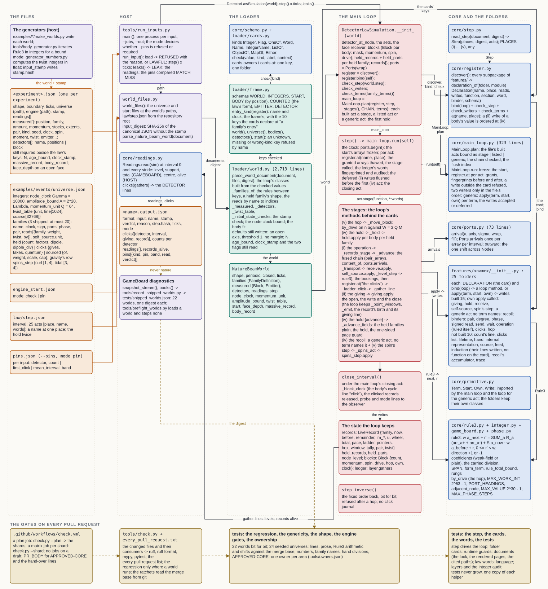

# The engine

This document describes the engine as the code holds it on `main`. It is one of the three current documents of the project, beside [ALGEBRA.md](ALGEBRA.md) (the law, one algebraic line per primitive) and [HIGHLIGHTS.md](HIGHLIGHTS.md) (the decisions in force). Anyone who enters the project should understand the whole engine from this page, the algebra and the code.

The engine is an integer simulator of a lattice of Nodes. A run reads three files, steps the lattice a declared number of intervals by one rule, and writes one output file. Nothing physical is written in the code: the families, their attributes and their integers come from the run's files, and every primitive is one folder found by its name.

## 1. The words

- **Node**: one place of the lattice. Its whole local information is its **NodeState**: the levels of every family at that Node, with the remainders of every division made there.
- **Link** and **Port**: a Node has six neighbours, one through each of its six Ports. A level moves from a Node to a neighbour only through a Port.
- **GameBoard**: the lattice of Nodes, a box of three sides. Each axis is closed (a wall) or periodic (a ring), as the world file says.
- **Family**: one kind of field. A family has parts (1, 3 or 6 components), a phase (1 or 2), a pair of integers, and its declared attributes. The families are the universe file's, never the code's.
- **Record**: one wave of one family on the GameBoard: two integer arrays, the level now and the level before, and an array of remainders. The engine steps a record with **Rule3**.
- **Body**: a bounded thing of one family on some Nodes, with a count of quanta per Node and a momentum. A body's own record is the standing wave at its Nodes. A body may hold other families' levels at its Nodes (the hold), may give a record (the giving) and may take one (the taking).
- **Detector**: a named set of Nodes that reads the records passing through its Ports and clicks when a record's booking reaches its threshold. A detector's click (the engine's `gather` line, the only line the output reads) is a **measurement**; everything else the engine writes is a GameBoard reading, a diagnostic. A body has a clock too: a cycle is counted when its own record's sum crosses zero, and the loop writes that cycle as an event line named `click`, which is the body's cycle and not a detector's click.
- **Click**: a whole quantum moving from a record to a detector or from a body to a new record. Quanta never split.
- **Primitive** (the owner's "feature"): one kind of attribute the engine can apply to any family, written once in its own folder and applied by the files' declarations, never by a family's name.
- **Interval**: one step of the whole GameBoard. The run's `ticks` is the number of intervals.

The core's integer modules under the engine: `core/integer.py` holds the working bound 2^63 - 1 with its check, the body's count step `by_drive` (the hop) and `by_clock`; `core/game_board.py` holds the Ports' fixed order (+X, -X, +Y, -Y, +Z, -Z; Port k on axis k div 2), the extent bound 1 through 4096, the self-Link of a periodic axis of extent one, and `MAX_VALUE` = 2^30 - 1, the bound on a family's quantum, a charge per unit and every pair's two integers; `core/phase.py` holds the bound of the world's phase circle, N a power of two from 2 through 65536, read by the loader alone; `core/ports.py` holds the six Ports of every Node (the arrival of an array through one Port, the six arrivals once per array per interval, the outward Ports of a set of Nodes), the one shift across Nodes of the package; `core/main_loop.py` holds the main loop.

## 2. The main loop



The drawing: one box per module, an arrow for what one hands to the next, the gates under them; it is redrawn when a module moves. One responsibility per module:

| Module | Holds | Hands on |
| --- | --- | --- |
| `tools/run_inputs.py` | one process per input; the verdict `LAWFUL`, `REFUSED` or `LEAK`; the pins compared | the output file |
| `src/event_universe/world_files.py` | the three files read at the world's paths, the step file from the repository root, the stamp's digest | the documents to the loader |
| `src/event_universe/loader/frame.py` with `core/schema.py` and `loader/cards.py` | the schemas of the files' keys; a family's entry is the frame's `name` and `clock` with the keys the folders' cards declare | the checked values |
| `src/event_universe/loader/world.py` | the loop's classes built from the checked values, and the rules between keys | the loaded world |
| `src/event_universe/events/detector_law.py` | the engine: the stages, the state and the readings, built from the loaded world | `step()`, the main loop's `run` |
| `src/event_universe/events/guards.py` | the engine's run-time guards, bound as the engine's methods: the arrays of the interval's start to freeze, the arrays each act's card grants, a card's writes, a write applied by name, the generic act's term, `Start` view and own record, the pace guard | the frozen arrays and the refusals to the main loop |
| `src/event_universe/core/main_loop.py` | the plan of the step file's acts and the walk of one interval under its guards | each act's stage or `apply` |
| `src/event_universe/core/register.py` with `core/step.py` | the folders' cards and the step file; `at(name, place)` | the act's function |
| `src/event_universe/features/<name>/` | one primitive each: its card and its `apply` or `bind` | its writes |
| `src/event_universe/core/rule3.py` with `core/ports.py` | the one arithmetic; the six arrivals, the one shift across Nodes | the next level and the remainder |
| `src/event_universe/core/readings.py` | the declared readings by kind, the clicks from the `gather` lines | the output's `readings` and `clicks` |

The main loop is `core/main_loop.py`: `MainLoop.plan` binds the step file's built acts to the engine's stages at load, and `MainLoop.run` walks them one interval at a time through the register, freezes the interval's start, thaws each act's arrays as its card grants, audits the ledger's words after every act and applies a (ii) card's deferred writes before the first (iv) act after (ii). The engine, `DetectorLawSimulation` in `src/event_universe/events/detector_law.py`, holds the stages, the state and the readings, is built from a loaded world and is handed to the main loop; its `step()` is the main loop's `run`. The Node's six Ports are `core/ports.py`.

The law's interval has five places, and every card declares one of them (the table below). The interval's order lives in one data file shared by every world, `law/step.json` (`src/event_universe/core/step.py` reads it): an ordered list of acts, each `[place, name]` or `[place, name, words]`, a primitive's name at its declared place with the words of its call; a name has one place and may have several acts, told apart by their words (the hold has two: `{"advance": false}` after the hop, `{"advance": true}` after the records). The loop's `step()` walks the file: the clock, then each built act in the file's order through `register.at(name, place)`, bound at load to the loop's stage of that name (the hop per body; the hold's first act; the records' pass under "the operation", the bodies' own records with the excitation rung and then every light record's fused step with its booking and its click inline, so (ii) is interleaved per record inside (i); the giving after the windows' close; the hold's second act, carrying the held families' records, the hold and the pace guard; the spin's step per body), then the interval's closing, which is the loop's own frame and no folder's: the bodies' clocks, the clicked records deleted, the readings. The ten (i) names and the clicks are listed acts: the register is asked for them where the file lists them, and their calls sit inside the records' pass. The recoil is a generic act: a card with a function of its own and no stage of the loop is called once per term of the files naming it, `apply(term, start, own)`, its writes taken by the loop (no term names the recoil today, so nothing is called). Four acts are nested inside the whole-board ones and audited under their own card: the clicks and the giving's window write inside each record's step, the held families' step under the operation's words at (iii), the pace guard under the signed read's. A built name without a stage, an act with words its stage does not take, or a file ordering the record's fused chain otherwise is refused at load by name, never run silently. Every run's output carries the file's digest (`step.hash`); to reorder the whole-board acts, edit the file. The five places, as the cards declare them:

| Place | What happens | The cards declaring it |
| --- | --- | --- |
| (i) | The clicking families' records step by Rule3, every component, with the transport through the Ports. | the operation, the send, the receive, the wait, the degree, the pair, the phase, the self-source, the signed read, the internal representation |
| (ii) | The bookings at the detectors' Ports, the ladder, the takings and the givings. A click writes the body's count at once; only the count's write into the held level waits for the hold at (iv) of the same interval, and there is no queue. | the clicks, the clicks list, the giving, the hand, the lifetime |
| (iii) | The held families' records step by Rule3. | the operation |
| (iv) | The holds are written: each body's count, momentum and spin written into the held families' levels at its Nodes. The hold writes here, then the source: the folder's `apply` on every sourced family, its argument the record family's counts D_i = now^2 - next x before summed at the records' step, the count's write added into the family's level after its own step, the remainder per Node the folder's own; then the recoil: the folder's `apply` per click of the interval on a body with a mode of its own (the emitter's period as the loop knows it; a body without one takes none; nothing of the recoil reads `fixed`), the taker at the sense +1 and the giver at -1 at its window's close, the click's tally per axis into the body's momentum with the stores on the universe's wall L (the least common multiple of the wavelengths 2 N q / p over the clocks of the families and the emitters, each whole or the clock refused at load). | the hold, the source, the recoil |
| (v) | The bodies on one Node: the hop and the spin's step run today; the feed, the induction and the recoil's accumulator are rows not built. | the hop, the spin's step, the feed, the induction, the recoil's accumulator |

The loop is built with the register: it discovers the folders, binds every card that has a binder to one of its own methods or to Rule3, checks the step file against the cards (a primitive the register lacks, one listed at a place it does not declare, or a built one left out is refused), checks the writers and checks every term of the files against the built names. Every whole-board, listed and generic act goes through the register by name and place, `register.at(name, place)`; a call at another place, or at one the file does not list, is refused. The main loop's guards, at run time: every array of the interval's start (the records', the bodies' own records' and masks, the held families', the pair arrays, the detector map, the spans, the paces' carries and the held levels) is read-only for the whole walk (an array an act rebinds, a record's stepped level, is frozen after that act for the acts after it), and an act writes in place only into the arrays its card grants (the hop the pair arrays and the detector map, the hold the held families' arrays, the operation the remainders); a write elsewhere is refused under the act's name; after every act the changed ledger words (a body's content, momentum, spin, position and remainders, the records' and the held families' levels by identity, the tallies, the paces, the records alive) must be among the act's card's writes, else the act is refused by word and target; two writers of one value and target in one interval must follow the file's order of the writers, else refused; a write of a body's value a card makes at (ii) is deferred and applied before the first (iv) act after (ii). A read leaves no trace, so the reading side is the law's words: a right-side card reads the start, a step card writes now, an after-the-step card's writes enter later; the primitives' bookkeeping (a body's wait, its window, the record's residue, wheel, age and box) has no ledger word yet and is listed, not audited. The audit stamps an array by its identity, so an in-place write into a thawed array passes it and the freeze alone guards it: the giving's window write adds the emitter's levels into the record's own stepped array inside the operation's act, under the giving's card, and its audit stamps that record's words. The giving's three acts are the folder's `apply` (features/giving) through the function the walk looked up for the interval: the open's count of the given family at the body, the write's level at the body's Nodes and the close's decision on the outward norm summed over the window; the loop keeps the record's birth, its giving line and the writes on the GameBoard, and the share of the body's momentum the open returns is not applied until the shipped worlds' re-record is decided. The signed read stays the loop's own read (`content_of` of features/signed_read) until the owner's word on the guard's upper side: the folder's `apply` refuses seventeen of the twenty-two shipped worlds, whose matter family reads a content one to seven units below zero beside the bodies (the pace above the edge P = Gamma of the pair [1, 1]). No act is named in the main loop: the loop's stage of the giving declares that it creates records (the records alive change under it; the law's named values of a card do not include them), and the chain check exempts the one whole-board act whose stage carries the chain's names. Two primitives that write the same value at the same place are ordered by the file (a body's value a click writes at (ii) is ordered among the writers of (iv), the write deferred from (ii) first); a card carries no order; a remainder is the writer's own and never collides.

The step is a bijection but for the click: `step_inverse` returns the state to the interval before, bit for bit, by Rule3's own backward line, for an interval with no click, no giving and no hop; it refuses a body that has hopped; it keeps the joint inverse's fixed order (the bodies' step back, every family at the interval's start levels, the held families and their hold last), its stage calls through the register; the main loop's guards cover the forward interval alone. There is no click journal; a test steps a click's interval back by hand.

The six Ports (`core/ports.py`): `arrival` gives the level arriving through one Port on the neighbours' addresses (the wrap on a periodic axis, a fill beyond an open face, the Node itself on a folded axis of extent one); `Ports.arrivals` takes the six arrivals of an array once per interval and hands the same six to every reader (the transport's arrival sums, the flux at the detectors' and the bodies' Ports, the shell of a body), the cache cleared at the interval's start and at the two in-place writers of exchanged arrays (the hold and the pair region); `Ports.outward` gives per Port the Nodes of a mask whose Link leaves it. The loop holds no shift of its own; the reads by coordinate that remain (the curls and the gradient of the spin's step, the giving line's read clocks, the moving set's frame, the click's gather, the dipole's write at the six neighbours) are listed here and bind with their folders.

### Rule3

Rule3 is the function `rule3` in `src/event_universe/core/rule3.py`, the only place in the code that holds the rule's arithmetic; beside it the module holds `coefficients` (the rule's integers at a Node), `form_term` (the conserved form's term), `rule_total_bound` (the load-time bound of the line inside int64) and `rungs` (the ladder's rungs). At every Node `rule3` it forms the next level from the level now, the level before, the six neighbours' arrivals and the remainder:

```
w a_next + r' = SUM_axis R_axis (arrival_+ + arrival_-) + S a_now - w a_before + r,  0 <= r' < w
```

The coefficients `R` (one per axis), `S` and `w` come from the family's pair, the Node clock `Gamma` and the paces at the Node. The content at a Node is the sum over the family's `reads` of weight times the read level (by plain) or minus q times weight times the read level (by sign), q the body's sign; the pace is `Gamma` minus the content, and the axis pace is the pace minus the axis content, so a body's count lowers the pace of what it reads and bends the wave. `coefficients` has two forms: the weak-field rule (`R_a = 2 num p_a^2`, `S` from the paces, `w = 6 den Gamma^2`) and the plain first-order rule (`R = num p`, `S = 6 den c`, `w = 3 den Gamma`); the loop steps a held family's record plain and every other record weak-field, and the loader chooses the weak-field bound where `Gamma > 1`. One floor division per Node per step; the remainder stays at the Node. After the hold the loop's guard ends the run when a reading family's content, or content plus an axis content, reaches `Gamma`. The step backward is `rule3` with `direction=-1`: the two levels exchanged and the sum negated, the remainder after carried in and the remainder before given out.

### The state a run keeps

The records, one dict by identity: each keeps its family, now, before, remainder, its residue u, wheel W and running total C, its pace, its first rung per detector, its ladder (the click at (2u + 1) norm against 2 W pace C), its support box, its window flag, count and outward norm, its momentum tally, its pair, its part marks, the second level of a phase-2 family and its twist. Per held family: one record per component, the time part and one silent record per further part, all stepped alike. Per body: its count per family in the loop's held table; its block keeps its own record, its drive, its spin before the step, `fixed`, its clock (count, previous sum, cycle start and length), its hop, its stepped count and the giving's counters. Per detector: its name, its measured body, its face flag, its set name and channel, a map of the Nodes it sits on, the set tables and the one face receiver; the ladder is the record's, and no click count is kept per detector (the runner derives the counts from the `gather` lines). The books: the conserved forms per family, computed in `books()` under `massive_record` and read by the tests alone, never by the step or the runner. Per-Node state beyond the records: the pace remainder per reading family, read family and axis; the dense pair arrays per family and pair; the detector map.

## 3. The folders, their cards and the register

Every primitive is one folder `src/event_universe/features/<name>/__init__.py`. The register (`src/event_universe/core/register.py`) finds the folders at load and reads each folder's card, its `DECLARATION`:

| Field | Meaning |
| --- | --- |
| `name` | the primitive's unique English name, "the hold"; the folder is the name without "the ", the apostrophe dropped, a space or a hyphen an underscore ("the spin's step" is `spins_step`, "the self-source" is `self_source`) |
| `place` | one of the five places, or "any" for a read-only line |
| `reads` | the values it reads, in the ledger's words |
| `writes` | the values it writes |
| `function` | its function where its code lives in the folder (the recoil's and the source's `apply`), or None; a card with both a function and a binder runs the binder's method today (the signed read) |
| `section` | its line in ALGEBRA.md |
| `word` | the mathematician's reading of its moment: the right side, the step, after the step, or any (the trace); optional, and only a word outside the four is refused |
| `binder` | `bind(loop)`, which gives the loop's method that implements it today while the code still sits in the loop; the operation's binder gives Rule3 itself |

A folder's function has one signature, `apply(term, start, own) -> writes`, declared in `src/event_universe/core/primitive.py`: the term is one line of the files (the primitive's name, its target value, the family or body it acts on, its degree, its weight, its table, and the line's label for a refusal); the start is the interval's read-only state (levels now and before, paces, counts, walls, momenta, the Ports' accumulators); the own is the primitive's own record at the Nodes it acts on, where every remainder of its divisions lives; the writes are whole integers into declared values, now or deferred to the next interval. The loop and `core/main_loop.py` import the declared types for the generic act; each built folder still defines its own term, start, own and writes classes in that shape.

The folders today: the operation (Rule3 itself), the send, the receive, the wait, the hold, the clicks, the clicks list, the count's line, the giving, the recoil, the recoil's accumulator, the source, the signed read, the self-source, the feed, the induction, the spin's step, the degree, the pair, the phase, the hop, the hand, the lifetime, the internal representation, the trace. Eight folders have neither a function nor a binder on main (the clicks list, the count's line, the feed, the hand, the induction, the lifetime, the recoil's accumulator, the trace): a line of the law not built. The loop's constructor, not the loader, refuses a term of the files naming one, through the register's check of the terms.

The register refuses, at load and by name: a folder without a card or whose folder name is not its declared name's; a dict-form card with an unknown or missing key; a `bind` that is not a function; a name declared twice; a place outside the six or a word outside the four; a step file naming an unknown primitive, listing one at a place it does not declare or leaving out a built one; a term naming a primitive the register does not hold, or one not built; and a call from the loop at a place other than the declared one. There is no version anywhere: a primitive that changes behaviour keeps every shipped world bit for bit or takes a new name.

## 4. The loader and the files

The loader is `src/event_universe/loader/` (`frame.py` the schemas, `world.py` the loop's classes built from the checked values), entered through `src/event_universe/world_files.py` (`parse_nature_beam_world`, `load_world`). The host module reads the three files and hands them to `parse_world_document`, which parses the world's document, checks every key by name and refuses an unknown key, a missing key or an out-of-bound value with a message naming it. The three files are read by `loader/frame.py` against schemas (`core/schema.py` holds the kinds, `loader/cards.py` collects the cards): the world file's own keys by the frame's schema (`WORLD`: an unknown key, a missing key and a wrong kind refused by name, the wording "the world has unknown keys: ..." and "the world lacks keys: ..."), with the universe, the bodies, the detectors, the readings and an inline twist table handed on as written to their readers in `loader/world.py`; the universe's integers by the frame's own, each family's entry by the folders' cards (each key of an entry beyond the frame's `name`, `quantum`, `clock` and `spins_step` is one folder's); the start file's mode by the frame's. `world.py` then translates the checked entries to its families list and keeps the rules the cards do not state (the three forms of `parts`, the self-source's unit, held or clicking; a key admitted only with another, as `face_depth` on an open face or `probes` under `massive_record`). The bodies and the detectors are read by the frame's schemas of today's form (`BODY`, `EMITTER`, `DETECTOR`) with the families known; `world.py` keeps the rules between keys (its lines are the loop's classes, the translation of the checked entries to them and those rules; the ray law's parse of lamps, tables, transformations, trains, columns, apertures and the covariant readings, its prose, its retired keys and the one engine's flag are deleted) and still writes defaults there: a detector's threshold is 1 (no longer a key), a body that is no well has no `margin` (None, no margin reading); every boundary axis is declared; `fixed`, `age_bound` and a body's `q`, `spin`, `moment` and `twist` are required, no default; a body without `ramp` or `start` has none (0). The acceptance tests for no default and no family name in the loader are green since #1236; the body of 9.120 alone, the word `sourced` and the source world wait on the loop's reads. What remains of `world.py` leaves with the loop's reads of the old form's keys.

### The world file

One experiment is one world file, a JSON object under `examples/events/`. Its keys:

- `shape`: the GameBoard's three sides. `boundary`: the word `open`, or an object with `x`, `y`, `z` each `open`, `periodic` or `closed`, a missing axis open; an open axis requires `face_depth`. `ticks`: the intervals to run, from 0.
- `universe`: the repository path of the universe file (a unit test may write the families inline instead, in the same form, checked against the same cards, the world then carrying the universe's integers itself; with a path those keys are refused). `engine`: the repository path of the start file.
- `measured`: the bodies. Every entry needs `position`, `family`, `amount` (the quanta), `momentum` with `momentum_before` (the momentum's two levels, now and one interval before: KEEP levels of the body's form, required by name, no default; a resting body declares them equal) and `stocks` (the other families it can give); a block also `ramp`, `start`, `pair`, `q`, `spin` with `spin_before` (the spin's two levels, declared together), `moment` and `twist`, with `extents` for a box; `kind` only where the family's pair is `"body"`; `seed` on a well and refused on a barrier or on light's kind; `margin` on a well; `clock` beside a profile and under `body_record`; `stock` when the `emitter` (the given family, the receivers, the weight, the twist) gives the body's own family. The keys are the frame's schema `BODY` (`loader/frame.py`, with `EMITTER` for the nested object), checked with the families known: an unknown key is refused by name, the ray law's `phase`, `directions`, `table`, `lamp` and `become` among them; the rules between keys (a block's ramp and start, a well's seed and margin, the emitter's stock) stay `world.py`'s. The law's form of a body is its family, its Nodes, its count per Node, its momentum at its two levels, its spin at its two levels and its moment where declared, and where it gives its stocks and its emitter, and nothing else: the frame's schema `COUNTED` reads it (`family`, `nodes` as one line per Node with its `node` and its `count`, `momentum` and `momentum_before`, `spin` with `spin_before` and `moment` where declared, `stocks` as family name to an integer from 1, and `emitter` by the frame's schema `GIVER`: `family`, `weight`, `norm`, `norm_denominator`, each from 1, and `receiver` where named, no period, no clock, no pair, no twist; at least one Node, no Node twice; the given family the body's own or one it stocks), a body is written in one of the two forms (by `position` or by `nodes`), and `world.py` refuses the law's form by name until the count's line is bound to the loop.
- `detectors`: each with `name` (required), `positions` and `block`, the index of the body it belongs to in `measured` (the frame's schema `DETECTOR`; the ray law's `threshold` and `reading` are no keys of the file); with `block` the positions are optional (the free Nodes beside the body), without it they are required and may not sit on a body's centre. The face names, the lifetime's name and the reserved prefix are refused as names.
- `readings`: what the run writes beyond its verdict, a list of named entries read by `src/event_universe/core/readings.py`. Each has a `name`, a `kind` and the kind's own keys: `clicks` of a `detector` (labelled DETECTOR); `level` of a `family` at a `node`, `support` (the Nodes whose level is nonzero) and `total` (the sum of absolute levels) of a `family`, `centre` of a `body` (GAMEBOARD); `alive`, the records alive (HOST). A periodic kind takes `every`, its stride from 1: read at the interval 0 and at every multiple of the stride. A reading writes nothing into the run. The refusals name the reading and the key: an unknown or missing key, an unknown kind, an empty or repeated name, a stride below 1, a detector, family or body the world lacks, a Node outside the shape.
- `stamp`: an object with the SHA-256 `hash` of the canonical JSON without the stamp key. It is compared only when a body's `seed` is a profile; a world without a profile needs no stamp, and a wrong one is not refused.
- The loader also requires `N`, `age_bound`, `clock_stamp`, `massive_record`, `body_record`, `engine` and `detectors`, `face_depth` on an open face and `fixed` on every body; `K`, `release` and `width` left the file with the last loader PR (#1236), with the direction table and the flight bound the loop no longer reads; the ray law's `suspension`, `directions`, `direction_bound`, `action`, `meeting`, `massive_rows`, `optical`, `drive_b`, `flow_link`, `centred_step`, `atom_level`, `in_transit` and `covariant_readings` are no keys of the file (refused as unknown). `N` is the phase steps, a power of two from 2 through 65536, read as the emitter's period. The thirteen check-mode worlds and the source worlds do not load on main for these keys (they are AHEAD in the regression record).

### The universe file

One file, `examples/events/universe.json`, names every family and every integer of the universe. Every world names it, and every family is on in every run; a world cannot turn a family off.

- `integers`: `node_clock` (Gamma, the pace of an empty Node), `amplitude_bound` (the largest level), `Lambda` (the weight of a read by sign), `momentum_unit`, and the `twist_table`: exactly `unit` (4 x node_clock x 2^16), `fine` (2^10 triples) and `coarse` (1 to 2^15 triples), each triple [c, s, d] with c^2 + s^2 = d^2 and d up to 10^9, the first [1, 0, 1], the angles rising, every product inside int64.
- `families`: one entry per family, at most twenty. Each has `name`, `sign` (the sign on its quantum, -1, 0 or 1, the signed read's card), `parts` (`[1]`, `[1, 3]` or `[1, 3, 6]`), `phase` (1 or 2), `pair` (two integers, or `"body"` for the family of bodies), `quantum` (an integer from 1, the family's quantum, the weight of its quanta in a body's count; the clicks card's copy agrees with it), `clock` where the family declares one (the pair form `[p, q]` of its phase per interval of age, the frame's key; a held family declares none), `spins_step` (`curl` and `tidal`, two pairs, the spin's step's weights; the frame's key, required on a family that holds the spin's dipole and read by the spin's step's folder; the leapfrog's span is core's one name, never a key), `reads` (each exactly `family`, `weight` an integer or the name of one of the universe's integers, `twist` an integer from 0 or `"own"`, `by` 1 or `"q"`), `self_source` (`unit` 0 for off, else at least 24 x amplitude_bound), and `held` (`count` content or sign, its `factors` per part, and its `dipole` with `dipole_div`, the divisor required with the dipole) or `clicks` (`gives`, `takes`, `quantum`) or `sourced` (the source folder's card: `of` a record family, `weight`, `scale`, `cap` where a table caps it; carried to the loop as the family's source term), at least one of the three. `sourced` passes the frame (the source folder's card declares it) and the loop reads it nowhere yet; its fragment in `examples/events/source/universe_entries.json` shows the form. The loop's families are built from the checked entries in `world.py` (`_families_of`: the rules between keys, a held family's shape, the reads by name to indices); no translation stands between the file and the loop.

### The start file

`examples/events/engine_start.json` holds the run's parameters, today one key, `mode`, `check` or `pin`: under `check` the runner refuses a pins file, under `pin` it requires one; the shipped file says `check`.

### The output

`tools/run_inputs.py` writes one file per world, `<name>.output.json`: its `format`, the input's name and stamp, the verdict (`LAWFUL`; `REFUSED` with the reason, written only for an exception at load or at the loop's construction; or `LEAK` when a family with no source moved), the ticks, the mode, the records alive, every click with its detector, interval, record and giving, the count per detector, the comparison per registered pin (its kind, the pin, the band, the value read, `MATCH` or `MISS`), and `readings`, the declared readings in their order, each with its name, kind, label, target, stride and lines. `REFUSED` and `LEAK` carry no clicks, counts or pins. A refusal during the run (the pace guard, a body off the GameBoard, the amplitude bound, a twist beyond the table) is raised from the step and aborts the command with a traceback, with no verdict written. The engine's event lines (giving, the body's clock, block, gather, probe, mode) go to an optional observer; the runner passes none and builds the clicks from the `gather` lines alone. A click is a measurement. The engine's state stream (`snapshot_stream`: the interval, the bodies' contents, the held families' levels, the records' integers, under the files' names) and the books are GameBoard readings, diagnostics for the tests and the record; they are never compared with nature.

## 5. The gates

Every pull request runs `python tools/check.py --base <the base commit>` (the one CI file, `.github/workflows/check.yml`). The tool selects the changed files and their consumers, runs `ruff`, `ruff format --check`, `mypy` on the typed modules and `pytest` on the selected tests, and adds four gates on every change:

| Gate | Test | What it holds |
| --- | --- | --- |
| Regression | `tests/test_shipped_worlds.py` | Every shipped world under `examples/events/` (a file with a shape, ticks and a universe, the AHEAD folders check_mode and source left out: 22 worlds) is replayed for its recorded intervals (its ticks where the run projects within 12 seconds, else the smaller of the ticks and 200) and compared bit for bit with `tests/shipped_worlds.json`, a digest of what the run is under the files' names. A moved digest is a changed run, and a world added, removed or changed without a re-record fails; an intended change re-records in the same commit with `tools/record_shipped_worlds.py` and says why. Until the one generator builds the worlds from zero, this record guards the code against unintended change only; it is no physical reference. |
| Genericity | `tests/test_genericity.py` | A seeded generator draws one to twenty families with random English names and random admitted attributes; every draw loads and runs, and five properties hold: renaming the families leaves the run bit for bit, reordering them leaves it bit for bit, a family with no source stays exactly zero, Rule3's conserved form holds where no click and no load acts, and the backward run returns the start. |
| Code shape | `tests/test_code_shape.py` | The ratchet against the merge base, read from git (no baseline file): a file of `src/` within the limits (every docstring one line, no record reference, under 400 lines, no Rule3 arithmetic outside `core/rule3.py` and no shift across Nodes anywhere) passes; a file beyond them grows no count, and a new one stays within them. No new copied function, and an internal of the loop imported by no more files than at the merge base. A feature folder imports `core/` or its own package and never another feature; `core/` imports the standard library alone, handles the arrays by their own methods, and imports nothing of the package outside itself; the one shift across Nodes is `core/ports.py`'s `arrival`, and the three tokens of a shift (`np.roll(`, `._shift(`, `.take(`) are counted in every other file. |
| Language | `tests/test_repository_language.py` | Every file of the repository is written in Latin script: the gate rejects Hebrew and six other scripts, ASCII paths and identifiers included; it detects scripts, not language, so a reviewer still reads the English. The hygiene and navigation tests beside it keep one canonical copy of each file and every link and anchor of the entry documents live. |
| Ownership | `tests/test_ownership.py` | One owner per area (`tools/owners.json`, `tools/ownership.py`): a pull request that touches another owner's area fails unless its body carries that owner's line `HANDED BY <owner>: <files>`, or the Boss's, which covers any area; the author is the owner whose session link is the body's last one, and a path in no area is free. |
| Documents | `tests/test_documents.py` | Only the three, the skills and the entry files exist; each of the three stays under its line cap with no history marker; every path a document or a skill cites in backticks exists in the tree. |
| The tests' shape | `tests/test_tests_shape.py` | `tests/` holds no more lines than at the merge base; no test imports a test; the copied setups, the docstrings beyond three lines, the history markers and the retired skips stay at or below the merge base's counts (`tools/tests_shape.py`). |
| Engine gates | `tests/test_engine_gates.py` | No new number, no family name and no unapproved module of `core/` in `src/` (`tools/engine_gates.py`). |
| The step and the cards | `tests/test_step_drives_the_loop.py`, `tests/test_folder_cards.py` | In one interval of a shipped world every built act of `law/step.json` is looked up once, in the file's order, and no built primitive runs outside an act; every card loads with the step file, and no card is built by position beyond the merge base. |
| Runtime guards | `tests/test_runtime_guards.py` | No assert as a runtime guard and no unused module-level name in `src/` and `tools/`. |

The acceptance tests state what the finished engine must satisfy: `tests/test_engine_acceptance.py`, no family name, no integer of the universe, no default, no flag and no version in the code, the rule as one function; `tests/test_loader_acceptance.py`, the same three on the loader alone, a body loaded by its four attributes alone, the words `sourced` and `readings` loading, an unknown key refused by name, and every key of a family's entry declared on one folder's card and written nowhere in the loader. A test the code fails today is marked xfail strict, with the reason; it turns green when the cut lands and then loses its mark.

`python tools/check.py --full` runs everything. CI (`.github/workflows/check.yml`) runs a plan job, `check.py --plan`, then one job per shard, `check.py --shard`: the selected suite in three parts and, where a world runs, the three heaviest shipped worlds each alone and the rest in two parts; a draft's pushes run nothing. Only the Boss merges into `main`, on green.

## 6. How to run a world

1. Write or pick a world file under `examples/events/`, naming the shipped universe and the start file. A generator writes the file and its stamp; a world with a profile body is refused at a wrong stamp.
2. Run it headless, one output file per world:

```
PYTHONPATH=src python tools/run_inputs.py --out runs/inputs --jobs 4 examples/events/<folder>/<world>.json
```

`--out` and `--jobs` are required. The command prints one JSON summary line per input and exits 0 only when every input is `LAWFUL`.

3. Read the output file: the verdict first. `REFUSED` names the key or value the loader refused. `LEAK` names the family that moved without a source. `LAWFUL` carries the clicks and the counts.
4. A pin (an expected count, first click or mean interval at a detector, with its band) is written in a pins file before the run, an object keyed by the input's file stem, and passed with `--pins`; the output then says `MATCH` or `MISS` per pin, and a detector with no click reads None and is `MISS`. A run is compared with a pin only on the owner's Go.
5. To record a world into the regression record, run `PYTHONPATH=src python tools/record_shipped_worlds.py` and commit the record with the world.

The engine never draws or renders in a run; a display reads the output afterwards.

## 7. How to add a feature

1. Read the primitive's line in ALGEBRA.md. The mathematician writes it; a primitive without a line is not built.
2. Make one folder, `src/event_universe/features/<name>/__init__.py`, on a short branch from `main`. Write its card, `DECLARATION`, with the name, the place, the reads, the writes, the section and the word; its act in the interval is one line of `law/step.json`, the core's, at its place. Write `apply(term, start, own) -> writes` with whole integers and its own remainders in `own`; write `check` for its refusals by name. Touch no shared file: the register finds the folder.
3. Keep the shape: every docstring one line (what it does and its ALGEBRA.md line), no record number, under 400 lines, no Rule3 arithmetic outside `core/rule3.py`, no shift of a level across Nodes outside the transport. Import `core/` alone.
4. Write its small test beside it, `tests/test_feature_<name>.py`: the line on the run files' numbers, the refusals, the inverse bit for bit, the hand identity of one Node.
5. Write its run files: a world under `examples/events/<name>/` with its stamp, the universe's fragment as a separate file if it adds a family word (appending to `universe.json` moves every recorded digest), and the blind expectations in the folder's `expectations.json`, beside the world, before any run. While the loader lacks the word, the folder is listed AHEAD in `tools/record_shipped_worlds.py` and in `tests/test_families_file.py`.
6. Run `python tools/check.py --base origin/main`. With the new primitive undeclared in the files, every shipped world must come out bit for bit; the regression gate says so.
7. Open the pull request. The mathematician approves the line with `APPROVED-MATH` on the pull request; the Boss merges on green. The loop's call of the new primitive at its place is the core's cut, Main Loop's, in its own pull request.
